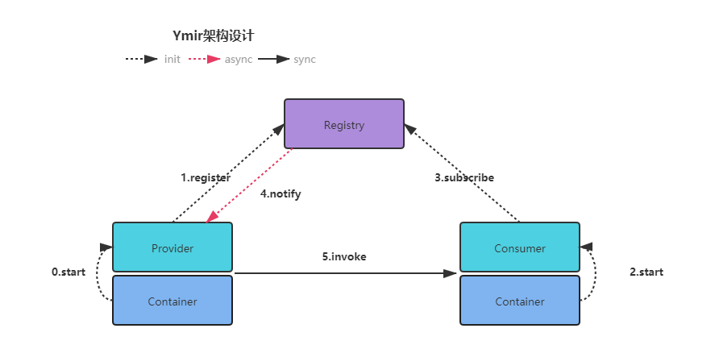
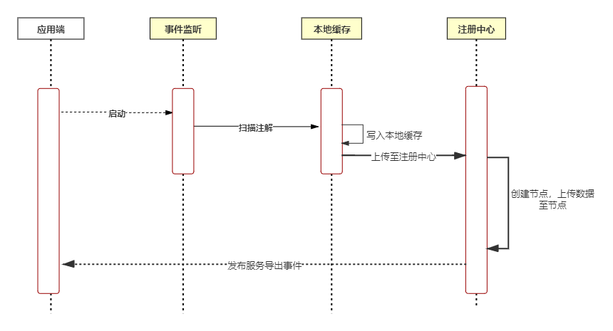
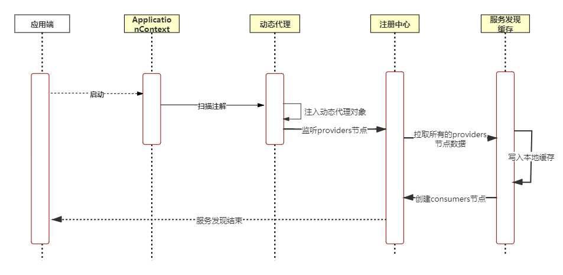
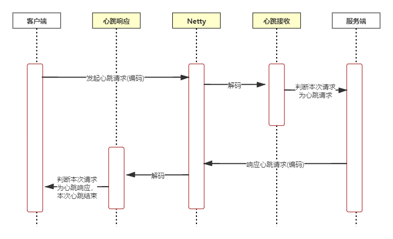
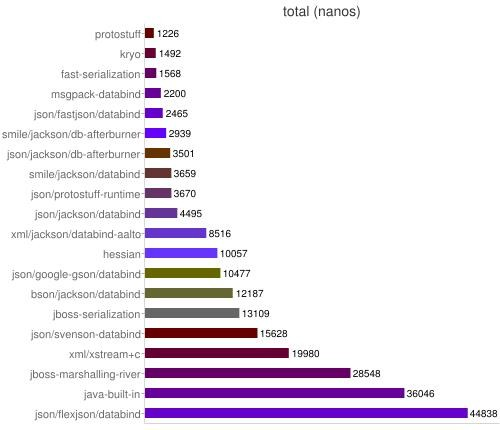

# Ymir
## 背景
Ymir，出自动漫[进击的巨人](https://baike.baidu.com/item/%E8%BF%9B%E5%87%BB%E7%9A%84%E5%B7%A8%E4%BA%BA/65641?fr=aladdin) 中的角色，始祖巨人尤米尔。因为很喜欢这个动漫，所以以这个命名了这个项目。

## Ymir是什么
一个Rpc框架的示例项目，大部分思路都来源于[Dubbo](http://dubbo.apache.org)的设计思想，主要的功能是基于Netty的服务之间的调用。大部分思想都是借鉴于Dubbo的一些设计理念，例如服务上传以及注册，包括SPI加载类等等。

## Ymir的基础架构
* 保持了和Dubbo一致的架构设计，区别在于去掉了Monitor的概念，关于服务监控，后面有时间会进行补充；
    * Provider启动，向Registry上传服务注册信息；
    * Consumer启动，先订阅所有需要的Provider信息，拉取所有的Provider信息落到本地缓存，之后注册Consumer节点；
    * Registry通知Provider，已经有Consumer接入；
    * Consumer向Provider发起请求；
  

## Ymir有哪些功能
* 只订阅(doing)
* 启动时检查(doing)
* 负载均衡
* 超时检测
* 服务重试(doing)
* 服务提供者直连
* 服务分组(doing)
* 多版本(doing)
* 注册事件通知

## 如何使用
### 前提操作
* 克隆代码到本地仓库
`git clone https://github.com/KevinClair/Ymir.git`
* 打包到本地Maven仓库
`mvn clean install -Dmaven.test.skip=true`
* 在需要使用的项目中添加Maven依赖
```xml
<dependency>
    <groupId>org.season</groupId>
    <artifactId>ymir</artifactId>
    <version>1.0.0-SNAPSHOT</version>
</dependency>
```
### 配置信息
#### 配置文件信息
* Ymir共支持以下几种类型的配置信息
```text
/**
 * 服务端口
 */
private Integer port = 20777;

/**
 * 服务序列化协议
 */
private String protocol = "protoBuf";

/**
 * 消息体的最大
 */
private int maxSize = 1024;
```
#### 注解支持
* @YmirService
```java
public @interface YmirService {

    /**
     * 权重
     */
    int weight() default 0;

    /**
     * 是否需要注册
     */
    boolean register() default true;

    /**
     * 分组
     */
    String group() default "";

    /**
     * 版本
     */
    String version() default "";
}
```
* @YmirReference
```java
public @interface YmirReference {

    /**
     * 启动时检查
     */
    boolean check() default false;

    /**
     * 负载均衡
     */
    String loadBalance() default "random";

    /**
     * 超时时间
     */
    int timeout() default 3000;

    /**
     * 重试次数
     */
    int retries() default 2;

    /**
     * 服务直连url
     */
    String url() default "";
}
```
### 开始使用
#### 服务端
* 编写接口
```java
public interface TestService {
    String test(String name);
}
```
* 在需要暴露的服务上添加注解
```java
@YmirService
public class TestServiceImpl implements TestService {
    @Override
    public String test(String name) {
        return "Hello "+name;
    }
}
```

#### 客户端
* 添加接口对应的Maven依赖
```xml
<dependency>
    <groupId>org.season</groupId>
    <artifactId>ymir-example-common</artifactId>
    <version>1.0.0-SNAPSHOT</version>
</dependency>
```
* 服务引用
```java
@RestController
public class TestController {

    @YmirReference
    private TestService service;

    @PostMapping("/name")
    public String get(@RequestParam("name") String name){
        return service.test(name);
    }
}
```
* 发送请求，返回结果
```shell
curl --location --request POST 'http://localhost:port/name?name=11'
```
## Ymir的一些设计理念
### SPI
#### Java SPI
* Java的SPI允许我们在对应的位置添加实现，就可以通过`ServiceLoader`来加载对应的接口实现，但是缺点在于会一次性加载所有的扩展点，例如：
* 新增一个接口
```java
public interface SpiInterface {
    String hello();
}
```
* 增加两个实现
```java
public class SpiInterfaceImplOne implements SpiInterface{
    @Override
    public String hello() {
        return "哈哈哈";
    }
}

public class SpiInterfaceImplSecond implements SpiInterface{
  @Override
  public String hello() {
    return "嘿嘿嘿";
  }
}
```
* 在resources目录下的META-INF/services/新建文件名org.season.ymir.spi.SpiInterface，填充值
```text
org.season.ymir.spi.SpiInterfaceImplOne
org.season.ymir.spi.SpiInterfaceImplSecond
```
* 运行测试用例
```java
public class SpiTest {
  @Test
  public void testJavaSpi() {
    Iterator<SpiInterface> iterator = ServiceLoader.load(SpiInterface.class).iterator();
    while (iterator.hasNext()) {
      System.out.println(iterator.next().hello());
    }
  }
}
```
* 查看返回结果
```text
哈哈哈
嘿嘿嘿
```
* 可以看到通过`ServiceLoader`去加载实现时，一次性加载了它的所有实现，而Ymir想要的是在需要的时候去加载对应的实现，所以通过Java SPI是不满足的。
#### Ymir SPI
* [Dubbo SPI](https://dubbo.apache.org/zh/docs/v2.7/dev/source/dubbo-spi/) ，在需要的时候去加载对应的实现，避免资源浪费
* [Dubbo SPI](https://dubbo.apache.org/zh/docs/v2.7/dev/source/adaptive-extension/) 在原有的Java SPI基础上扩展了很多，包括自适应加载等非常强大的功能
* Ymir借鉴了Dubbo SPI以及[Shenyu SPI](https://github.com/apache/incubator-shenyu/tree/master/shenyu-spi) 的设计，基本做到了在需要的时候去加载对应实现的功能，通过`ExtensionLoader`来加载实现
* 新增一个接口
```java
// @SPI注解来标注这是一个可以被SPI管理的类，value代表它的默认实现
@SPI("one")
public interface SpiInterface {
    String hello();
}
```
* 增加两个实现
```java
public class SpiInterfaceImplOne implements SpiInterface{
    @Override
    public String hello() {
        return "哈哈哈";
    }
}

public class SpiInterfaceImplSecond implements SpiInterface{
  @Override
  public String hello() {
    return "嘿嘿嘿";
  }
}
```
* 在resources目录下的META-INF/ymir/新建文件名org.season.ymir.spi.SpiInterface，文件名为接口的全路径名；
> 这里的内容为key=value的样式，其中key为对应的扩展实现，通过`ExtensionLoader`进行加载时需要用到
```text
one=org.season.ymir.spi.SpiInterfaceImplOne
two=org.season.ymir.spi.SpiInterfaceImplSecond
```
* 运行测试用例
```java
public class SpiTest {
    @Test
    public void testYmirSpi() {
        // 当getLoader里为空时，会读取@SPI注解内的默认值的实现
        SpiInterface loader = ExtensionLoader.getExtensionLoader(SpiInterface.class).getLoader("");
        System.out.println(loader.hello());

        // 加载key为one的实现类
        SpiInterface loaderOne = ExtensionLoader.getExtensionLoader(SpiInterface.class).getLoader("one");
        System.out.println(loaderOne.hello());

        // 加载key为two的实现类
        SpiInterface loaderTwo = ExtensionLoader.getExtensionLoader(SpiInterface.class).getLoader("two");
        System.out.println(loaderTwo.hello());
    }
}
```
* 查看返回结果
```text
哈哈哈
哈哈哈
嘿嘿嘿
```
* 在Ymir的很多地方都用到了SPI的，例如负载均衡和序列化
### 服务注册
* 服务注册信息会落到本地缓存内，防止注册中心挂掉后，服务端无法处理请求；
  
### 服务发现
* 服务发现主要是在客户端操作，客户端来发现自己需要注入的服务信息，之后存储在本地，用来后续的服务调用发起
  
### Netty请求处理器
#### 心跳检测处理器
* Netty本身有自己的心跳检测，但是心跳检测的时间间隔非常长，有两个小时，所以Ymir自己做了客户端以及服务端的心跳检测
* 大概设计为客户端向服务端发送心跳请求，服务端接收到心跳请求后，做出回应，客户端接收到心跳回应，本次心跳结束；
  
#### 编码/解码处理器
* Ymir的编码解码依然用的是Netty自己的编码解码器，在里面对写出以及接收到的数据进行编码解码操作；
  * [MessageToByteEncoder](https://github.com/netty/netty/blob/4.1/codec/src/main/java/io/netty/handler/codec/MessageToByteEncoder.java) 编码器
  * [ByteToMessageDecoder](https://github.com/netty/netty/blob/4.1/codec/src/main/java/io/netty/handler/codec/ByteToMessageDecoder.java) 解码器
* 在客户端和服务端都添加了相同的编码器，添加了不同的解码器，因为服务端和客户端接收到的模型是不一致的，所以需要分开处理
  * [MessageEncoder](https://github.com/KevinClair/Ymir/blob/master/src/main/java/org/season/ymir/core/codec/MessageEncoder.java) 编码器
  * [MessageRequestDecoder](https://github.com/KevinClair/Ymir/blob/master/src/main/java/org/season/ymir/core/codec/MessageRequestDecoder.java) 请求解码器
  * [MessageResponseDecoder](https://github.com/KevinClair/Ymir/blob/master/src/main/java/org/season/ymir/core/codec/MessageResponseDecoder.java) 请求解码器
### 序列化
#### Gson序列化
* 使用GsonUtils工具类来对请求参数以及返回参数进行序列化，反序列化操作
* 需要在配置文件中设置序列化方式为Gson序列化
#### Protostuff序列化
* 采用[Protostuff](https://github.com/protostuff/protostuff) 的序列化方式，是Ymir默认的序列化方式
#### Kryo序列化
* 采用[Kryo](https://github.com/EsotericSoftware/kryo) 的序列化方式
#### 序列化性能对比
  
### 负载均衡
#### 随机
* 随机获取存在的服务列表中的某一个Service，计算时加权重
#### 轮询
* 轮询请求服务列表中的Service
## 有问题反馈
在使用中有任何问题，欢迎反馈给我，可以用以下联系方式跟我交流
* Email: kevinclair@apache.org

## 致谢
感谢以下的项目，在个人学习过程中，给我起到了很大的帮助

* [Dubbo](http://dubbo.apache.org/zh-cn/)
* [shenyu](https://github.com/apache/incubator-shenyu)

## 最近计划
最近准备开始着手做一次项目的重构和升级，调整一下项目的模块以及工程架构；
* Netty优化，重新定义消息结构，考虑是否需要在消息报文中写入序列化类型；
* 取消SpringBoot父框架；
* YmirService属性扩展，增加多版本，分组等属性；
* YmirReference属性扩展，多版本，分组等；
* Filter过滤器；
* 负载均衡算法优化；
